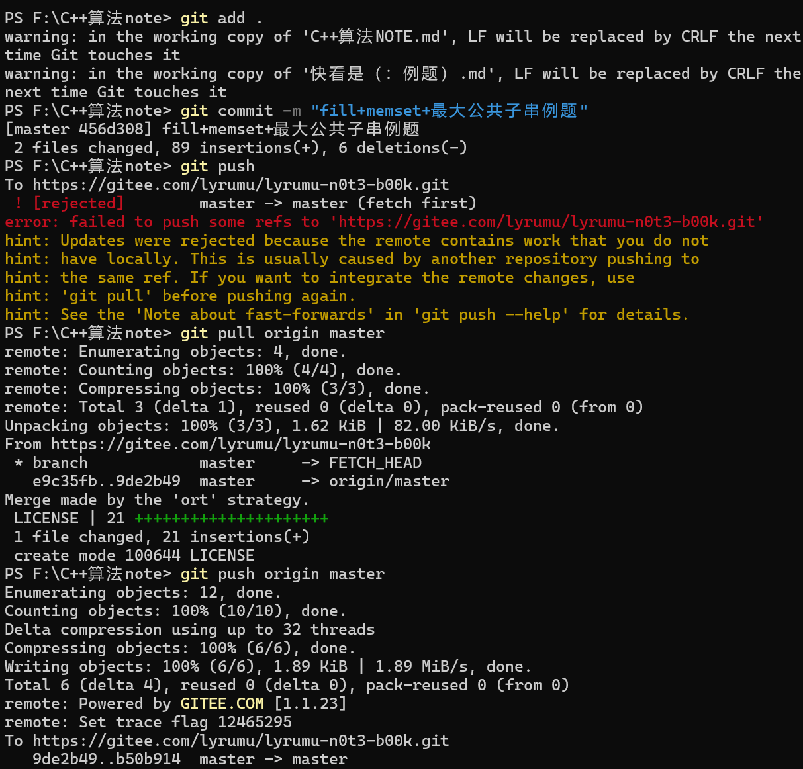

# <mark>Git</mark>

---


`git`是代码和项目的存储管理工具 可以保存历史版本 

每次提交修改都拥有独立的存档点

---

## <mark> Git安装</mark>

 首先cmd打开终端输入

```bash
where git
```

判断一下系统有无安装git

没有的话去官网安装即可

[Redirecting&hellip;](https://git-scm.com/download/win)

安装过程~~还挺麻烦的~~

可以一步步问AI该选择哪些选项......

---


## <mark>网站选择</mark>

首选`Github`

但是方便起见 打算先用国内的`Gitee`练手

---


## <mark>仓库创建</mark>

以下操作在gitee内进行.

- 初始化仓库：
  (1)选择语言:
  按需或不选，主要是给仓库打上一个“主要编程语言”的标签
  (2)添加.gitigore:
  一般推荐添加，用于告诉git哪些文件不需要管理
  (3)添加开源许可证：
  一般选择`MIT-license`(开源)

        

（以上内容后期应该都是可以再添加的，先不选应该没事）


- 设置模板：
  (1)`readme文件`:
  仓库的**门面和说明书**，按需选择，后期可再添加

        (2)`issue模板文件`:

        便于别人给你的仓库提交**bug或功能建议**

        (3)`pill request模板文件`:

        当别人想为你**贡献代码**时用这个模板来请求


- 选择模型分支：
  可以先默认选择“main”或“master”分支

---


## <mark>本地文件上传</mark>

本地已有仓库 将其上传gitee 利于保存和管理 防止文件丢失

适用于个人项目

即先本地建立文件 再上传

不过一般是先创建仓库再clone到本地进行开发


注意！选择本地已有的文件上传时 新建仓库**不要勾选readme**

因为会导致仓库和本地的初始化内容不统一！

如果已经勾选了 建议之后使用**强制推送**，使用本地内容覆盖仓库.

```bash
#先在文件资源管理器中进入所需上传的文件
#然后右键文件空余处，点击在终端中打开
#然后确保终端中显示的目录就是当前想要上传的文件，then：
git init
#个人开发者的话可以用global全局设置 即所有项目用同一个身份
git config user.name "你的用户名"
git config user.email "你的邮箱@example.com"
#以下具体内容在gitee中复制即可
git remote add origin https://gitee.com/你的用户名/仓库名.git
#上传
git add .
git commit -m "初始提交：上传项目文件"
git push -u origin master -f "强制推送(只在初始化时使用)"
```

后续在本地编辑更新完项目后 再更新上传到git：

```bash
git add .
git commit -m "更新内容给介绍"
git push
```

git配置状态检查：

```bash
git config --list
#或者
git config --global --list
```

---

## <mark>Wrong1</mark>

`wrong`:

由于在gitee上给仓库添加了`license`文件

此时仓库有license文件 但本地并没有

and 我并未记得

直接更新了新的本地内容

于是乎：


在进行`git push`时出现报错

处理方法：

```bash
git pull origin master#拉取远程仓库的变化文件，并更新到本地
```

此时终端可能会进入另一个界面，叫做"vim编辑器"，不要慌，

接着先按一下`Esc`键，再输入`:wq`,最后爽按一下`Enter`!

再就会恢复正常了

最后再输入

```bash
git push origin master
#或者这里直接用git push更好
```


